# 📅 Smart Appointment Management System

A full-stack **Healthcare Appointment Management App** designed with **React Native** frontend and **Spring Boot** backend (Java), backed by **Neon Postgres** cloud database. It facilitates booking doctor appointments, real-time notifications, secure video consultations, role-based dashboards, and much more.

---

## 🚀 Features Overview

### 🔓 Authentication & Roles
- Common login for **Admin**, **Doctor**, and **User**
- Role-based navigation after login
- Secure user registration & password change

---

### 👤 User Module
- Profile view and update
- Search doctors by specialization
- Popular doctors showcased in Home screen
- Appointment booking with:
  - Day, Date, Time selection
  - Approval wait
  - Payment after approval
  - Scheduled video consultation
- In-app notification updates for:
  - Appointment booked
  - Approved
  - Payment success
  - Appointment completion

---

### 👨‍⚕️ Doctor Module
- Register and wait for **admin approval**
- Post-approval login access
- View appointments where selected by users
- Approve appointments based on availability
- Join video call after payment is done

---

### 🧑‍💼 Admin Module
- Login dashboard with stats:
  - Doctors, Patients, Appointments, Payments
- View all appointments
- Approve registered doctors

---

## 🧱 Folder Structure

```
AppointmentApp/
├── smartAppointmentFrontendApp/             # React Native frontend
│ ├── App.js
│ ├── assets/
│ │ └── (your images/screenshots)
│ ├── components/
│ └── screens/
│ └── (Home, Login, DoctorProfile, Appointment, etc.)
│
└── DoctorConsultantApp/                      # Spring Boot backend
├── src/
├── pom.xml
└── application.properties
```

---

## 🧰 Tech Stack

- **Frontend**: React Native + Expo
- **Backend**: Java Spring Boot
- **Database**: PostgreSQL (Neon DB)
- **Deployment**: Render (Java Backend)
- **Video Call**: Custom room ID per appointment (one room for user + doctor)

---

## 🌐 Backend Deployment

- Backend Hosted: [`https://smart-appointment-management-app.onrender.com`](https://smart-appointment-management-app.onrender.com)
- Database: [Neon Postgres Console](https://console.neon.tech/app/projects/shy-river-22797986/branches/br-dawn-bar-ad9fa590)

---

## 📦 Java Dependencies (Spring Boot)

```xml
<!-- pom.xml -->
<dependencies>
  <dependency>
    <groupId>org.springframework.boot</groupId>
    <artifactId>spring-boot-starter-web</artifactId>
  </dependency>
  <dependency>
    <groupId>org.springframework.boot</groupId>
    <artifactId>spring-boot-starter-data-jpa</artifactId>
  </dependency>
  <dependency>
    <groupId>org.postgresql</groupId>
    <artifactId>postgresql</artifactId>
  </dependency>
</dependencies>
```

---

## Setup and Installation

1. **Clone the repository:**

   ```bash
   git clone https://github.com/username/smartappMaster.git
   cd smartappMaster
   ```

2. **Configure the database:**
   Update the `application.properties` file:

   ```properties
   spring.datasource.url=jdbc:postgresql://localhost:5432/smartapp_db
   spring.datasource.username=postgres
   spring.datasource.password=gopika
   ```

3. **Build the project:**

   ```bash
   mvn clean install
   ```

---

## Running the Application

1. **Start the application:**

   ```bash
   mvn spring-boot:run
   ```

## 🔗 API Endpoints

### **Admin APIs**
| Method |                     Endpoint                         |       Description        |
|--------|------------------------------------------------------|--------------------------|
| POST   | `localhost:8080/api/admin/appointments`              | View all appointments    |
| PUT    | `localhost:8080/api/admin/approve-doctor/{doctorId}` | Approve a doctor         |
| GET    | `localhost:8080/api/admin/dashboard`                 | Get admin dashboard data |

---

### **Doctor APIs**
| Method |                       Endpoint                               |    Description                   |
|--------|--------------------------------------------------------------|----------------------------------|
| POST   | `localhost:8080/api/doctor/register`                         | Register a doctor                |
| POST   | `localhost:8080/api/doctorLogin`                             | Doctor login                     |
| GET    | `localhost:8080/api/doctor/profile/{doctorId}`               | Get doctor profile               |
| GET    | `localhost:8080/api/doctor/search?specialization=Dermatology`| Search doctors by specialization |

---

### **User APIs**
| Method |               Endpoint                              | Description                     |
|--------|-----------------------------------------------------|---------------------------------|
| POST   | `localhost:8080/api/login`                          | General login                   |
| POST   | `localhost:8080/api/user/register`                  | User registration               |
| POST   | `localhost:8080/api/userLogin`                      | User login                      |
| GET    | `localhost:8080/api/user/profile/{userId}`          | Get user profile                |
| PUT    | `localhost:8080/api/user/profile/update/{userId}`   | Update user profile             |
| PUT    | `localhost:8080/api/user/change-password/{userId}`  | Change user password            |
| GET    | `localhost:8080/api/home/doctor/{doctorId}`         | Get doctor details for homepage |
| GET    | `localhost:8080/api/notifications/USER/{userId}`    | Get user notifications          |

---

### **Appointment APIs** 
| Method |                                       Endpoint                                                           |    Description      |
|--------|----------------------------------------------------------------------------------------------------------|---------------------|
| POST   | `localhost:8080/api/appointments/book?userId={userId}&doctorId={doctorId}&date=YYYY-MM-DD&time=HH:MM:SS` | Book an appointment |
| GET    | `localhost:8080/api/appointments/user/{userId}`                                                          | Get user appointments |
| GET    | `localhost:8080/api/appointments/doctor/{doctorId}`                                                      | Get doctor appointments |
| PUT    | `localhost:8080/api/appointments/approve/{appointmentId}`                                                | Approve an appointment |
| PUT    | `localhost:8080/api/appointments/complete/{appointmentId}`                                               | Mark appointment as completed |

---

### **Payment APIs**
| Method |                      Endpoint                     |  Description   |
|--------|---------------------------------------------------|----------------|
| POST   | `localhost:8080/api/payments/pay/{appointmentId}` | Make a payment |


## Configuration

Update `application.properties` for database and server port:

```properties
server.port=8080
spring.datasource.url=jdbc:postgresql://localhost:5432/smartapp_db
spring.datasource.username=your-username
spring.datasource.password=your-password
spring.jpa.hibernate.ddl-auto=update
spring.jpa.show-sql=true
```

---

## 📲 Screenshots

Added **UI** in the assets/ folder and reference them below:

<h2 align="center">Authentication</h2>
<p align="center">
  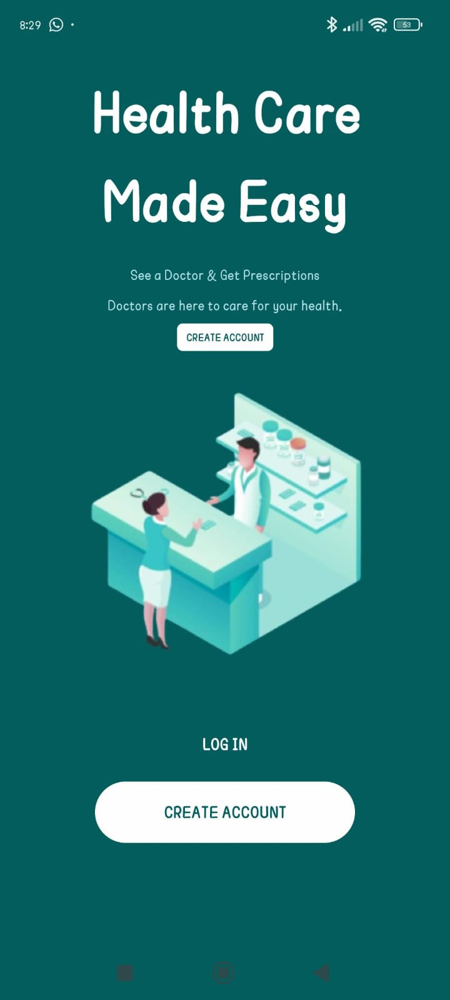
  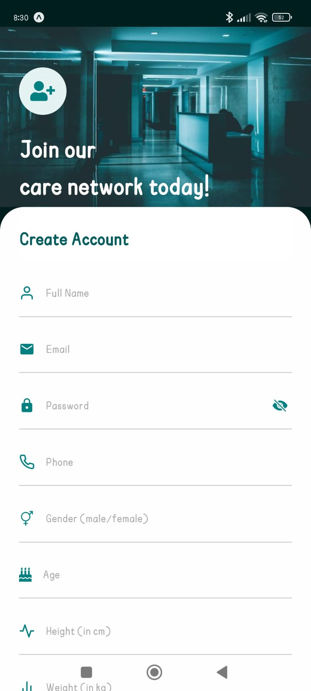
  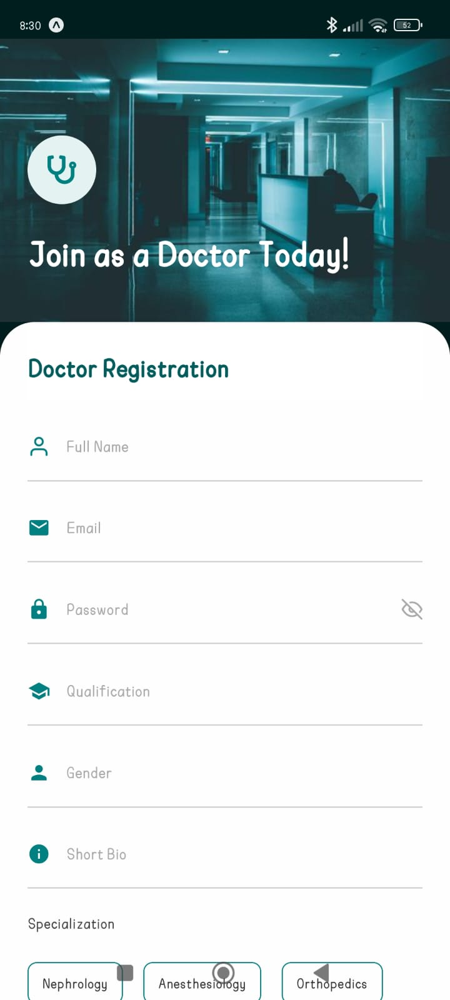
  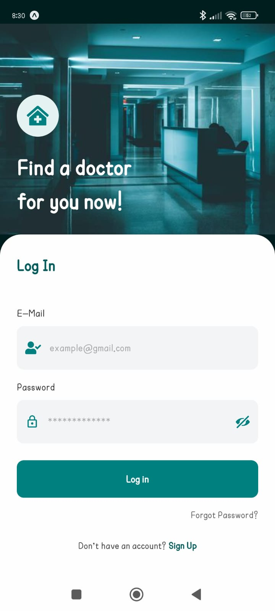
</p>

---

<h2 align="center">Admin View</h2>
<p align="center">
  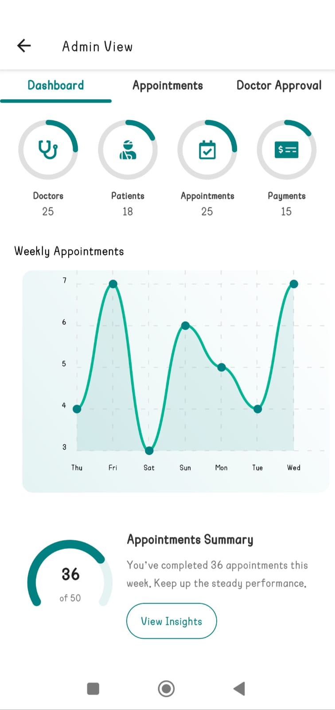
  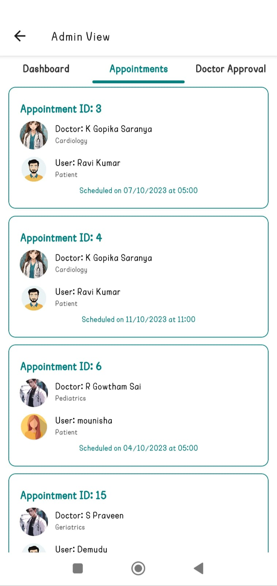
  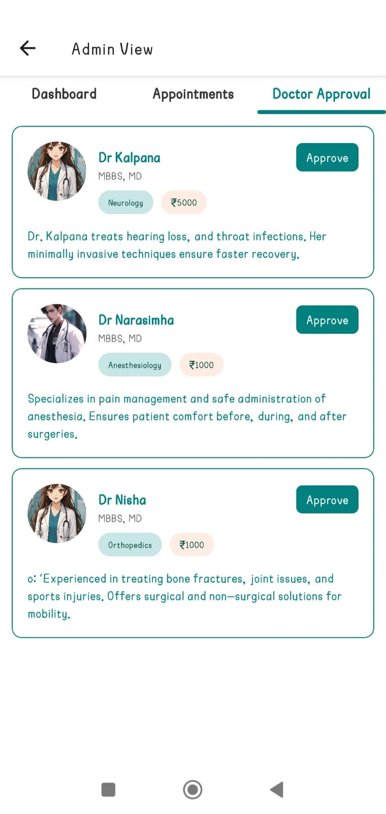
</p>

---
<h2 align="center">Doctor View</h2>
<p align="center">
  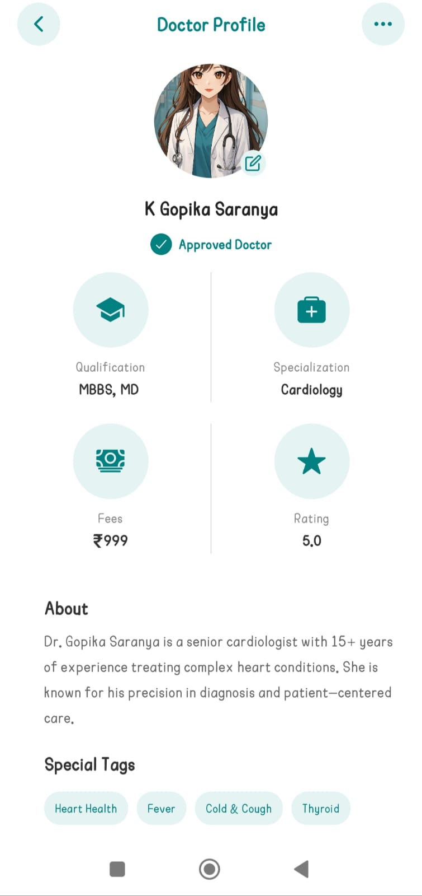
  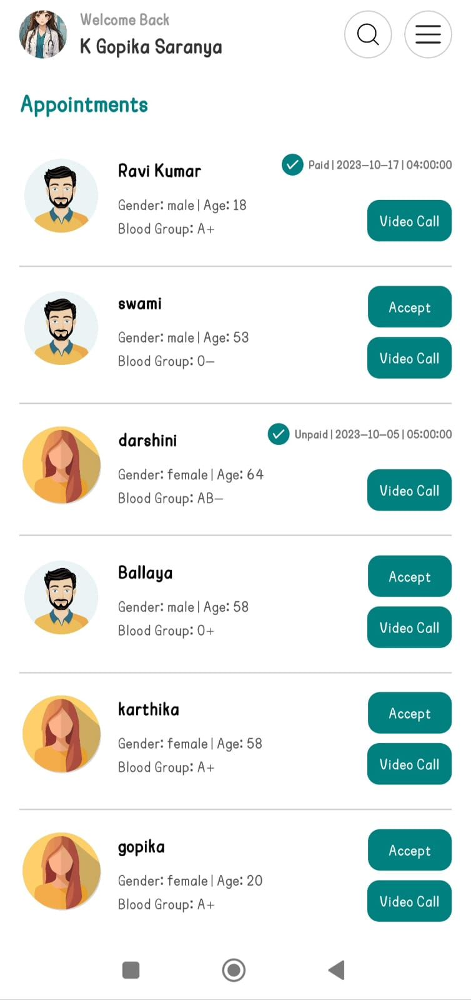
</p>

---
<h2 align="center">User View</h2>
<p align="center">
  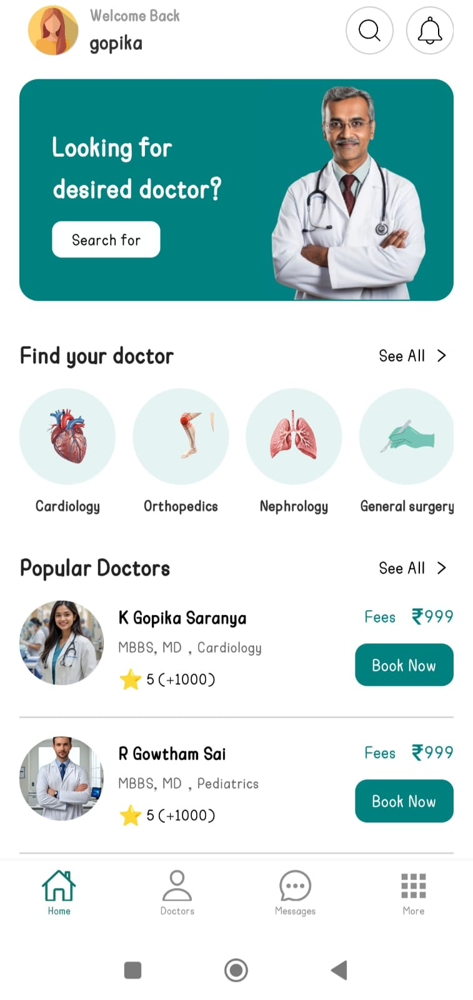
  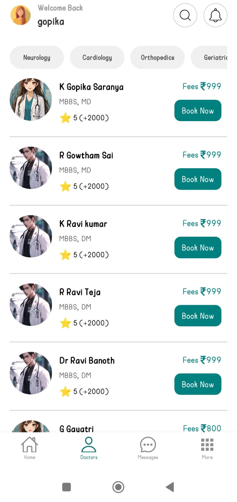
  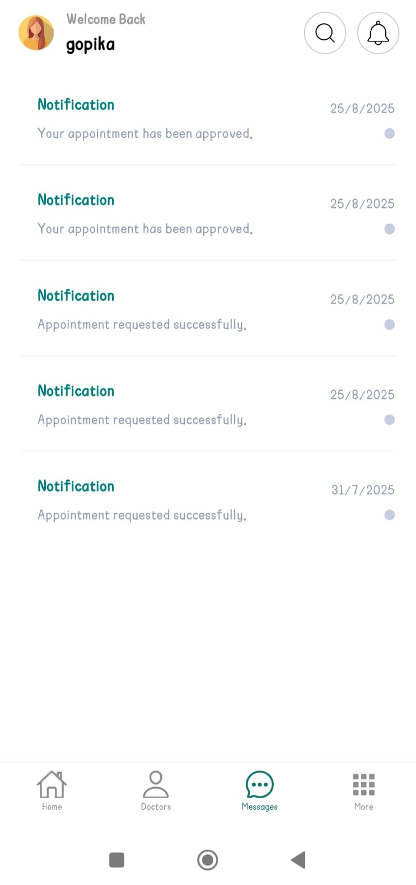
  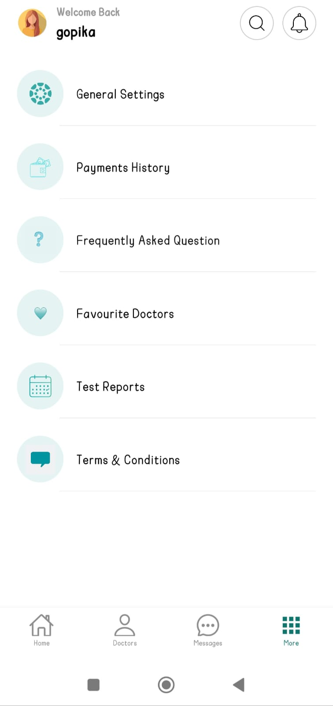
</p>

---

<h2 align="center">Appointment Booking</h2>
<p align="center">
  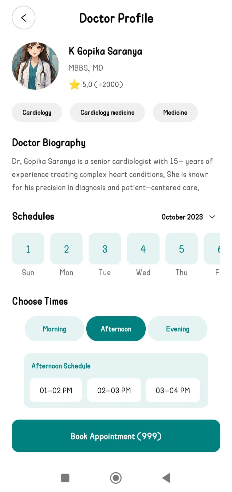
  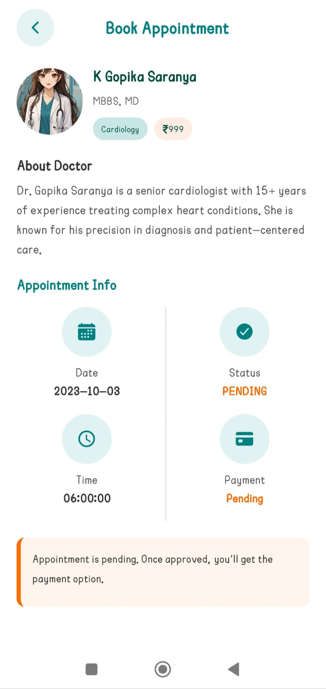
  
</p>

## Contributing

1. Fork the repository.
2. Create a feature branch:

   ```bash
   git checkout -b feature-branch
   ```
3. Commit your changes:

   ```bash
   git commit -m "Add new feature"
   ```
4. Push to the branch:

   ```bash
   git push origin feature-branch
   ```
5. Open a pull request.

## 🚀 Project Deployment – smartapp Management System

This section provides a complete guide to deploying the project using **Docker**, **Render**, **Neon.tech**.

## 🧠 Backend Deployment – Spring Boot + Docker + Render

###  1. Build the JAR File

```bash
./mvnw clean package
```

 This generates:
  `target/smartapp-backend-0.0.1-SNAPSHOT.jar`

### 2. Create Dockerfile in project root

```Dockerfile
# Stage 1: Build with Maven
FROM maven:3.8.4-openjdk-17 AS build
WORKDIR /app
COPY pom.xml .
RUN mvn dependency:go-offline
COPY src ./src
RUN mvn clean package -DskipTests

# Stage 2: Run with JDK
FROM openjdk:17-jdk-slim
WORKDIR /app
COPY --from=build /app/target/smartapp-backend-0.0.1-SNAPSHOT.jar .
EXPOSE 8080
ENTRYPOINT ["java", "-jar", "/app/smartapp-backend-0.0.1-SNAPSHOT.jar"]
```

### 3. Set Environment Variables in PowerShell (temporary)

```bash
$env:DB_URL="jdbc:postgresql://your-neon-url"
$env:DB_USERNAME="your-neon-username"
$env:DB_PASSWORD="your-password"
$env:FRONTEND_URL="your_frontend_url"
```

### 4. Build Docker Image

```bash
docker build -t smartapp-backend .
```

### 5. Tag the Docker Image

```bash
docker tag smartapp-backend gopikasaranya/smartapp-deployment:v1
```

### 6. Push Image to Docker Hub

```bash
docker push gopikasaranya/smartapp-deployment:v1
```

> 📝 Make sure the repo exists on Docker Hub:  
> [https://hub.docker.com/repository/docker/gopikasaranya/smartapp-deployment](https://hub.docker.com/repository/docker/gopikasaranya/smartapp-deployment)

---

### 7. Set up PostgreSQL on Neon.tech

- Go to: https://neon.tech
- Create a project (e.g., `smart-Appointment-Management-Syatem`)
- Create a database (e.g., `smartapp-db`)
- Copy connection string like:
  
  ```
  jdbc:postgresql://ep-xxxxxxx.neon.tech/smartapp-db
  ```

### 8. Deploy Backend on Render

- Go to: https://render.com
- Click **New > Web Service**
- Select **Docker** as deployment method
- Connect DockerHub image:  
  `gopikasaranya/smartapp-deployment:v1`
- Add the following **Environment Variables**:

```
DB_URL=jdbc:postgresql://<neon-db-url>
DB_USERNAME=<your_neon_username>
DB_PASSWORD=<your_neon_password>
FRONTEND_URL=<your_frontend_url>
```
## Demo Video

Check out the live demo of the **Smart Appointment Management System**:

[](https://drive.google.com/file/d/1VSTcR2wKID1rBdnw2Gbb8ZJXYcoM3b70/view?usp=sharing)


## 📞 Contact

For questions, issues, or contributions:

- 📧 Email: kotakalagopika@gmail.com  
- 🐙 GitHub: [github.com/https://github.com/gopika04-saru](https://github.com/gopika04-saru)